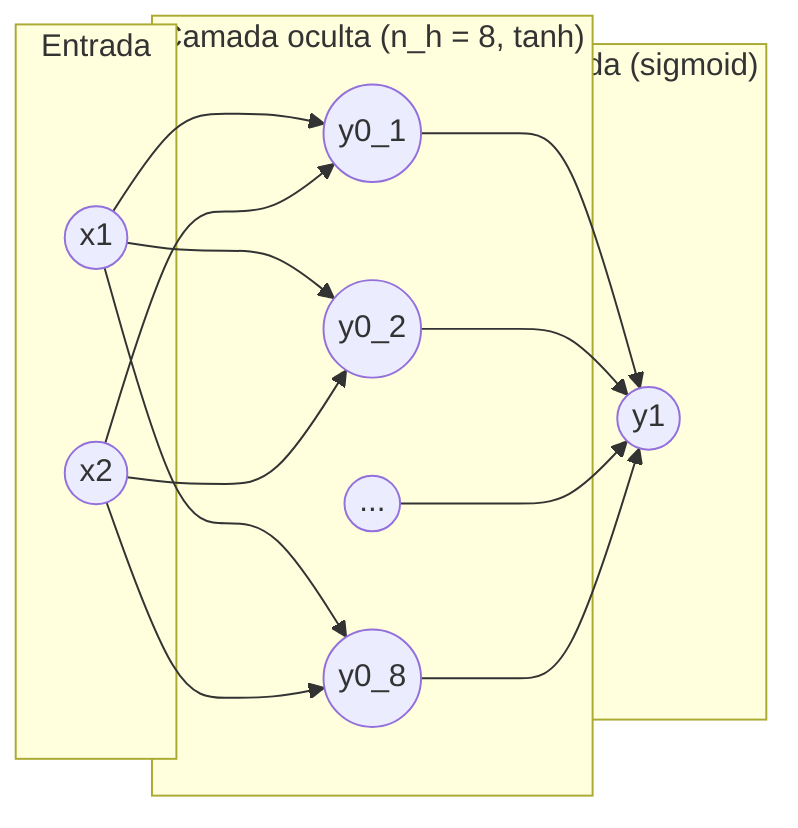

# Projeto — Generalização do `exemplo4.py`

## Objetivo

O trabalho consiste em **projetar e implementar uma rede neural
multicamadas (MLP)** a partir do arquivo `exemplo4.py` fornecido em aula.
O grupo tem liberdade para modificar a arquitetura, as funções de
ativação, o otimizador, o dataset e a estratégia de treino.

Nossa proposta foi **generalizar** o código original — antes escrito
com índices fixos e ativações *hard-coded* — para uma forma
**vetorizada**, capaz de suportar diferentes tamanhos de camada,
ativações e datasets, além de incluir uma **verificação numérica do
gradiente** para garantir a corretude do backpropagation.

---

## O que foi modificado em relação ao `exemplo4.py`

| Item | `exemplo4.py` (original) | `rede_neural_generalizada.py` (nosso) |
|------|--------------------------|-------------------------------------|
| **Dataset** | `make_moons` | `make_circles` (mais difícil) |
| **Nº amostras** | 100 | 200 |
| **Normalização** | Não | Sim (z-score) |
| **Neurônios ocultos** | 2 | 8 |
| **Ativação oculta** | `sigmoid` | `tanh` |
| **Ativação de saída** | `sigmoid` | `sigmoid` |
| **Forward/Backward** | índices fixos (`w0[0,0]`, ...) | vetorizado (produto matricial) |
| **Otimizador** | GD puro | GD com **momento** |
| **Treino** | batch completo | **mini-batch** (16 amostras) |
| **Nº épocas** | 10.000 | 200 |
| **Verificação de gradiente** | Não | **Sim** (diferenças finitas) |
| **Plots** | apenas scatter | scatter + curva de loss + fronteira de decisão |

---

## Arquitetura da Rede

MLP totalmente conectada, com forward pass vetorizado:



$$
v^{(0)} = W^{(0)} x + b^{(0)}, \qquad y^{(0)} = f\big(v^{(0)}\big)
$$
$$
v^{(1)} = W^{(1)} y^{(0)} + b^{(1)}, \qquad y^{(1)} = g\big(v^{(1)}\big)
$$

onde $x \in \mathbb{R}^{d}$ (entrada), $W^{(0)} \in \mathbb{R}^{n_h \times d}$,
$b^{(0)} \in \mathbb{R}^{n_h}$, $W^{(1)} \in \mathbb{R}^{1 \times n_h}$,
$b^{(1)} \in \mathbb{R}$, $f$ = `tanh` (camada oculta, $n_h = 8$) e $g$ = `sigmoid`
(camada de saída).

A perda usada é o erro quadrático médio (MSE) por amostra:

$$
L = \frac{1}{2}\big(y^{(1)} - d\big)^2
$$

---

## Derivação Analítica do Backpropagation

### Camada de saída

$$
\frac{\partial L}{\partial y^{(1)}} = y^{(1)} - d,
\qquad
\frac{\partial L}{\partial v^{(1)}} = \frac{\partial L}{\partial y^{(1)}} \cdot g'\big(v^{(1)}\big)
$$

Para a sigmoide, $g'(v) = y(1-y)$, logo:

$$
\frac{\partial L}{\partial v^{(1)}} = \big(y^{(1)} - d\big)\, y^{(1)}\big(1 - y^{(1)}\big)
$$

$$
\frac{\partial L}{\partial W^{(1)}} = \frac{\partial L}{\partial v^{(1)}} \cdot \big(y^{(0)}\big)^{\top},
\qquad
\frac{\partial L}{\partial b^{(1)}} = \frac{\partial L}{\partial v^{(1)}}
$$

### Camada oculta

Propagando o erro para trás (regra da cadeia):

$$
\frac{\partial L}{\partial y^{(0)}} = \big(W^{(1)}\big)^{\top} \frac{\partial L}{\partial v^{(1)}},
\qquad
\frac{\partial L}{\partial v^{(0)}} = \frac{\partial L}{\partial y^{(0)}} \odot f'\big(v^{(0)}\big)
$$

($\odot$ = produto de Hadamard). Para `tanh`, $f'(v) = 1 - y^2$:

$$
\frac{\partial L}{\partial v^{(0)}} = \frac{\partial L}{\partial y^{(0)}} \odot \big(1 - (y^{(0)})^2\big)
$$

$$
\frac{\partial L}{\partial W^{(0)}} = \frac{\partial L}{\partial v^{(0)}} \cdot x^{\top},
\qquad
\frac{\partial L}{\partial b^{(0)}} = \frac{\partial L}{\partial v^{(0)}}
$$

### Tabela de ativações e derivadas

| Ativação | $f(v)$ | $f'(v)$ |
|----------|--------|---------|
| Sigmoide | $\dfrac{1}{1+e^{-v}}$ | $y(1-y)$ |
| Tanh | $\tanh(v)$ | $1 - y^2$ |
| ReLU | $\max(0, v)$ | $1$ se $v>0$, senão $0$ |
| Leaky ReLU | $\max(0.01v, v)$ | $1$ se $v>0$, senão $0.01$ |

No código, cada ativação é implementada como um par de funções
(`sigmoid`/`sigmoid_prime`, `tanh`/`tanh_prime`, `relu`/`relu_prime`), e a
derivada é calculada a partir da **saída** $y$ (mais eficiente e estável),
exceto para a ReLU, cuja derivada depende da entrada $v$.

### Observação sobre Cross-Entropy

Se a perda MSE for substituída por *binary cross-entropy* mantendo a
saída sigmoide:

$$
L = -\big[d \log y^{(1)} + (1-d)\log(1-y^{(1)})\big]
\;\Longrightarrow\;
\frac{\partial L}{\partial v^{(1)}} = y^{(1)} - d
$$

o termo $y(1-y)$ cancela com o denominador da cross-entropy, tornando o
gradiente mais estável numericamente. Essa simplificação não foi adotada
no projeto (optamos por manter o MSE, como no `exemplo4.py` original),
mas fica registrada como possível evolução do trabalho.

---

## Verificação Numérica do Gradiente

Para validar a implementação do backward, cada gradiente analítico é
comparado com uma aproximação por diferenças finitas centradas:

$$
\frac{\partial L}{\partial \theta} \approx
\frac{L(\theta + \varepsilon) - L(\theta - \varepsilon)}{2\varepsilon},
\qquad \varepsilon = 10^{-5}
$$

Isso é feito percorrendo elemento a elemento de cada parâmetro
($W^{(0)}, b^{(0)}, W^{(1)}, b^{(1)}$), perturbando-o em $\pm\varepsilon$ e
recalculando a perda (função `numerical_grad`). O erro relativo máximo
obtido na execução (função `check_gradients`), para uma amostra do
dataset, foi:

| Parâmetro | Erro relativo máx. |
|-----------|---------------------|
| `W0` | 1.77e-10 |
| `b0` | 2.56e-10 |
| `W1` | 2.48e-10 |
| `b1` | 5.02e-12 |

Todos os erros estão muito abaixo do limiar de $10^{-6}$, confirmando
que o backpropagation implementado está correto.

> Os valores exatos podem variar levemente a cada execução, pois a
> geração do dataset (`make_circles`) não usa semente fixa; apenas a
> inicialização dos pesos e o treino são reprodutíveis (`np.random.seed`).

---

## Resultado do Treinamento

- Dataset: `make_circles` (200 amostras, normalizado), não linearmente
  separável.
- Otimizador: gradiente descendente com momento ($\text{momentum} = 0.9$),
  mini-batches de 16 amostras, 200 épocas, $\text{lr} = 0.1$.
- A loss média cai de $\approx 0.125$ (época 0) para $\approx 0.012$
  (época 180).
- **Acurácia final: 199/200 = 99,50%**.

O script gera três figuras:

- `circles.svg` — dataset normalizado;
- `curva_loss.svg` — curva de aprendizado (loss por época);
- `fronteira_decisao.svg` — fronteira de decisão aprendida pela rede.

---

## Arquivos do repositório

| Arquivo | Descrição |
|---------|-----------|
| `exemplo4.py` | Código original fornecido em aula (rede fixa em 2 neurônios, índices *hard-coded*, dataset `make_moons`). |
| `rede_neural_generalizada.py` | Nossa implementação: rede vetorizada e genérica, com verificação numérica de gradiente, treino em mini-batch com momento e geração dos gráficos de resultado. Renomeado a partir de `atividade.py`. |
| `requirements.txt` | Dependências do projeto (`numpy`, `matplotlib`, `scikit-learn`). |

## Como executar

```bash
python -m venv venv
source venv/bin/activate
pip install -r requirements.txt
python rede_neural_generalizada.py
```
